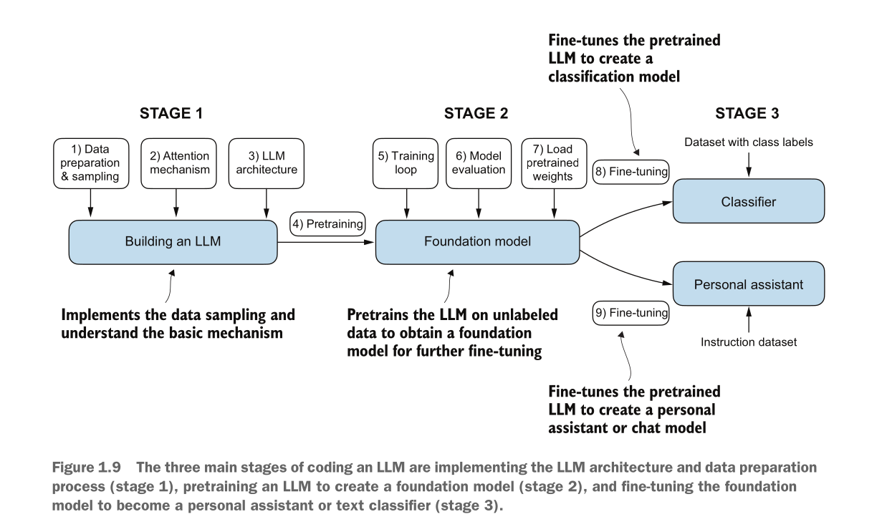

## stages of coding LLMs

---

position embeddings:

- relative positional embeddings

> Instead of focusing on the absolute position of a token, the emphasis of relative posi-
tional embeddings is on the relative position or distance between tokens. This means
the model learns the relationships in terms of “how far apart” rather than “at which
exact position.” The advantage here is that the model can generalize better to sequences
of varying lengths, even if it hasn’t seen such lengths during training.

- absolute positional embeddings

> For each position in the input sequence, a unique embedding is added to the token’s embedding to
convey its exact location.

> OpenAI’s GPT models use absolute positional embeddings that are optimized
during the training process rather than being fixed or predefined like the positional
encodings in the original transformer model. This optimization process is part of the
model training itself.