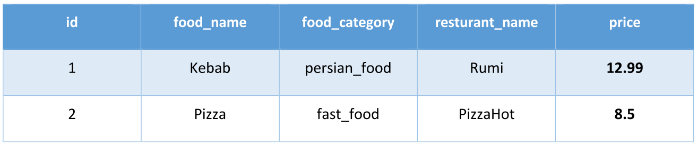

# ChatFood Application

UT-NLP Course project

HW 6

Deadline: Feb 2025

---

stack: 
- langGraph
- LanceDB
- Tavily
- LlamaParse
- Chainlit
- langsmith

chatbot language: English

recommended llm (by instructor): Gemini 1.5 Flash

---

## database schema

tables:
- **food_orders**
- **foods**

food_orders table:

foods table:

---

## basics parts:

### general and specialized food information

architecture: **Agentic RAG/Hybrid RAG**

examples: 

- is it harmful to eat yogart with kebab?
- What is Moroccan kebab?

### Customer Service
Users can track the status of their orders, track orders, and verify their status.
You should use the search functions in your order database.

examples:
- My order has not arrived Can you follow?
- I would like to cancel order number 123.

### Food Search
This capability allows users to search for available food items in stores using the app. The goal of this section is to replace the existing food items with recommended apps. The recommendation is recorded.

examples:
- What restaurants have pizza?
- what is the price of kebab?

### Food Recommendation

recommended architectures: **Reflection Agent** or **Plan and Execute**

examples:

- I want a spicy fast food.
- I want Arabic food.

### UI

recommended UI: **chainlit**

---