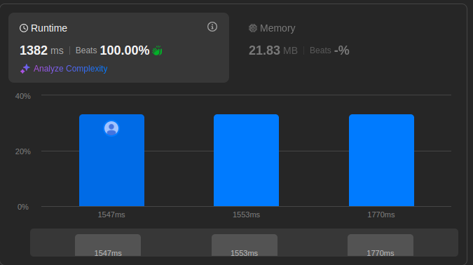

Reason You are a algorithmic problem solver. you should give your answer in pythonic code. be precise and careful about your solution.

# 2019. The Score of Students Solving Math Expression

You are given a string s that contains digits 0-9, addition symbols '+', and multiplication symbols '*' only, representing a valid math expression of single digit numbers (e.g., 3+5*2). This expression was given to n elementary school students. The students were instructed to get the answer of the expression by following this order of operations:

Compute multiplication, reading from left to right; Then,
Compute addition, reading from left to right.
You are given an integer array answers of length n, which are the submitted answers of the students in no particular order. You are asked to grade the answers, by following these rules:

If an answer equals the correct answer of the expression, this student will be rewarded 5 points;
Otherwise, if the answer could be interpreted as if the student applied the operators in the wrong order but had correct arithmetic, this student will be rewarded 2 points;
Otherwise, this student will be rewarded 0 points.
Return the sum of the points of the students.

Example 1:

Input: s = "7+3*1*2", answers = [20,13,42]
Output: 7
Explanation: As illustrated above, the correct answer of the expression is 13, therefore one student is rewarded 5 points: [20,13,42]
A student might have applied the operators in this wrong order: ((7+3)*1)*2 = 20. Therefore one student is rewarded 2 points: [20,13,42]
The points for the students are: [2,5,0]. The sum of the points is 2+5+0=7.

Example 2:

Input: s = "3+5*2", answers = [13,0,10,13,13,16,16]
Output: 19
Explanation: The correct answer of the expression is 13, therefore three students are rewarded 5 points each: [13,0,10,13,13,16,16]
A student might have applied the operators in this wrong order: ((3+5)*2 = 16. Therefore two students are rewarded 2 points: [13,0,10,13,13,16,16]
The points for the students are: [5,0,0,5,5,2,2]. The sum of the points is 5+0+0+5+5+2+2=19.

Example 3:

Input: s = "6+0*1", answers = [12,9,6,4,8,6]
Output: 10
Explanation: The correct answer of the expression is 6.
If a student had incorrectly done (6+0)*1, the answer would also be 6.
By the rules of grading, the students will still be rewarded 5 points (as they got the correct answer), not 2 points.
The points for the students are: [0,0,5,0,0,5]. The sum of the points is 10.

Constraints:

3 <= s.length <= 31
s represents a valid expression that contains only digits 0-9, '+', and '*' only.
All the integer operands in the expression are in the inclusive range [0, 9].
1 <= The count of all operators ('+' and '*') in the math expression <= 15
Test data are generated such that the correct answer of the expression is in the range of [0, 1000].
n == answers.length
1 <= n <= 104
0 <= answers[i] <= 1000

write your answer in this style:

class Solution(object):
    def scoreOfStudents(self, s, answers):
        """
        :type s: str
        :type answers: List[int]
        :rtype: int
        """
        

---

## solution

```python
class Solution(object):
    def scoreOfStudents(self, s, answers):
        """
        :type s: str
        :type answers: List[int]
        :rtype: int
        """
        # First, compute the correct answer using the intended order:
        # 1. Process multiplications left-to-right within each addition segment.
        # 2. Then add the segments.
        def evaluate_correct(expr):
            parts = expr.split('+')
            total = 0
            for part in parts:
                mult = 1
                # Each part has single digit numbers separated by '*'
                for ch in part.split('*'):
                    mult *= int(ch)
                total += mult
            return total
        
        correct = evaluate_correct(s)
        
        # Tokenize the expression: numbers and operators
        tokens = []
        for ch in s:
            if ch in "+*":
                tokens.append(ch)
            else:
                tokens.append(int(ch))
        
        n = len(tokens)
        memo = {}
        
        # Recursive function to compute all possible results from tokens[i:j+1]
        # by adding parentheses in every possible way.
        def ways(i, j):
            # Use memoization to avoid redundant calculations.
            if (i, j) in memo:
                return memo[(i, j)]
            # If the segment is just a number, return it as a set.
            if i == j:
                memo[(i, j)] = {tokens[i]}
                return memo[(i, j)]
            
            res = set()
            # Iterate over operators located at odd indices.
            for k in range(i+1, j, 2):
                op = tokens[k]
                left_set = ways(i, k-1)
                right_set = ways(k+1, j)
                for left in left_set:
                    for right in right_set:
                        if op == '+':
                            val = left + right
                        elif op == '*':
                            val = left * right
                        # Only consider values that are within bounds (<= 1000)
                        if val <= 1000:
                            res.add(val)
            memo[(i, j)] = res
            return res
        
        # Compute all valid results by different parenthesization
        possible = ways(0, n - 1)
        
        # Grade the answers
        points = 0
        for ans in answers:
            if ans == correct:
                points += 5
            # Otherwise, if the answer is one of the possible answers from different parenthesizations
            # (and is not equal to the correct answer), then score 2 points.
            elif ans in possible:
                points += 2
        return points
```


---

## result

