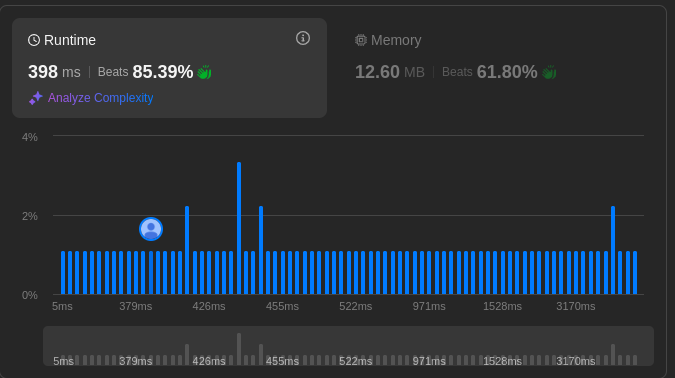

Reason You are a algorithmic problem solver. you should give your answer in pythonic code. be precise and careful about your solution.

# 2044. Count Number of Maximum Bitwise-OR Subsets

Given an integer array nums, find the maximum possible bitwise OR of a subset of nums and return the number of different non-empty subsets with the maximum bitwise OR.

An array a is a subset of an array b if a can be obtained from b by deleting some (possibly zero) elements of b. Two subsets are considered different if the indices of the elements chosen are different.

The bitwise OR of an array a is equal to a[0] OR a[1] OR ... OR a[a.length - 1] (0-indexed).


Example 1:

Input: nums = [3,1]
Output: 2
Explanation: The maximum possible bitwise OR of a subset is 3. There are 2 subsets with a bitwise OR of 3:
- [3]
- [3,1]
Example 2:

Input: nums = [2,2,2]
Output: 7
Explanation: All non-empty subsets of [2,2,2] have a bitwise OR of 2. There are 23 - 1 = 7 total subsets.
Example 3:

Input: nums = [3,2,1,5]
Output: 6
Explanation: The maximum possible bitwise OR of a subset is 7. There are 6 subsets with a bitwise OR of 7:
- [3,5]
- [3,1,5]
- [3,2,5]
- [3,2,1,5]
- [2,5]
- [2,1,5]
 

Constraints:

1 <= nums.length <= 16
1 <= nums[i] <= 10^55

write your answer in this style:

class Solution(object):
    def countMaxOrSubsets(self, nums):
        """
        :type nums: List[int]
        :rtype: int
        """
        
 
---

## solution

```python
class Solution(object):
    def countMaxOrSubsets(self, nums):
        """
        :type nums: List[int]
        :rtype: int
        """
        # First, determine the maximum bitwise OR we can obtain by OR-ing all elements.
        max_or = 0
        for num in nums:
            max_or |= num

        self.count = 0
        n = len(nums)
        
        # Define a recursive function to explore all subsets.
        def dfs(i, current_or):
            # When we've considered all elements, check the resulting OR.
            # Note: We skip the empty subset since the problem requires non-empty subsets.
            if i == n:
                if current_or == max_or:
                    self.count += 1
                return
            # Option 1: Include nums[i] in the subset.
            dfs(i + 1, current_or | nums[i])
            # Option 2: Exclude nums[i] from the subset.
            dfs(i + 1, current_or)
        
        # Start recursion from index 0 with an initial OR value of 0.
        dfs(0, 0)
        return self.count

# Example usage:
if __name__ == "__main__":
    solution = Solution()
    
    # Test cases
    print(solution.countMaxOrSubsets([3, 1]))      # Expected output: 2
    print(solution.countMaxOrSubsets([2, 2, 2]))   # Expected output: 7
    print(solution.countMaxOrSubsets([3, 2, 1, 5]))  # Expected output: 6
``` 

### Explanation

1. **Determining Maximum OR**:  
   We first compute `max_or` by bitwise OR-ing all elements in `nums`. This is the maximum possible OR we can achieve with any subset.

2. **DFS for Subset Enumeration**:  
   We define a recursive function `dfs(i, current_or)` which explores all possible subsets by deciding at each index `i` whether to include `nums[i]` or not.  
   - When the end of the list is reached (`i == n`), we check if the accumulated OR (`current_or`) equals `max_or` and, if so, increment our `count`.
  
3. **Counting Valid Subsets**:  
   The recursive exploration covers all \(2^n\) subsets (including the empty subset) automatically. The empty subset is implicitly excluded because its OR would be `0` (and given `nums[i] >= 1`, `max_or` is never `0`).

This method is efficient for \( n \leq 16 \) as the maximum number of subsets is \( 2^{16} \approx 65,536 \).


---

## result

