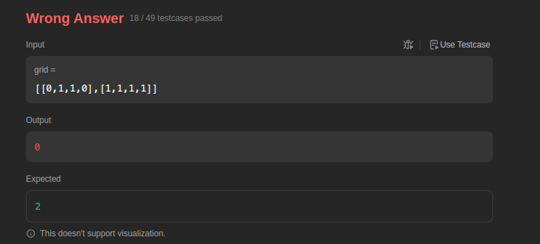

Reason You are a algorithmic problem solver. you should give your answer in pythonic code. be precise and careful about your solution.

# 2088. Count Fertile Pyramids in a Land

A farmer has a rectangular grid of land with m rows and n columns that can be divided into unit cells. Each cell is either fertile (represented by a 1) or barren (represented by a 0). All cells outside the grid are considered barren.

A pyramidal plot of land can be defined as a set of cells with the following criteria:

The number of cells in the set has to be greater than 1 and all cells must be fertile.
The apex of a pyramid is the topmost cell of the pyramid. The height of a pyramid is the number of rows it covers. Let (r, c) be the apex of the pyramid, and its height be h. Then, the plot comprises of cells (i, j) where r <= i <= r + h - 1 and c - (i - r) <= j <= c + (i - r).
An inverse pyramidal plot of land can be defined as a set of cells with similar criteria:

The number of cells in the set has to be greater than 1 and all cells must be fertile.
The apex of an inverse pyramid is the bottommost cell of the inverse pyramid. The height of an inverse pyramid is the number of rows it covers. Let (r, c) be the apex of the pyramid, and its height be h. Then, the plot comprises of cells (i, j) where r - h + 1 <= i <= r and c - (r - i) <= j <= c + (r - I
).

Given a 0-indexed m x n binary matrix grid representing the farmland, return the total number of pyramidal and inverse pyramidal plots that can be found in grid.

Example 1:

Input: grid = [[0,1,1,0],[1,1,1,1]]
Output: 2
Explanation: The 2 possible pyramidal plots are shown in blue and red respectively.
There are no inverse pyramidal plots in this grid. 
Hence total number of pyramidal and inverse pyramidal plots is 2 + 0 = 2.

Example 2:

Input: grid = [[1,1,1],[1,1,1]]
Output: 2
Explanation: The pyramidal plot is shown in blue, and the inverse pyramidal plot is shown in red. 
Hence the total number of plots is 1 + 1 = 2.

Example 3:

Input: grid = [[1,1,1,1,0],[1,1,1,1,1],[1,1,1,1,1],[0,1,0,0,1]]
Output: 13
Explanation: There are 7 pyramidal plots, 3 of which are shown in the 2nd and 3rd figures.
There are 6 inverse pyramidal plots, 2 of which are shown in the last figure.
The total number of plots is 7 + 6 = 13.

Constraints:

m == grid.length
n == grid[i].length
1 <= m, n <= 1000
1 <= m * n <= 10^5
grid[i][j] is either 0 or 1.

write your answer in this way:

class Solution(object):
    def countPyramids(self, grid):
        """
        :type grid: List[List[int]]
        :rtype: int
        """
        
---

## answer

```python
class Solution(object):
    def countPyramids(self, grid):
        """
        :type grid: List[List[int]]
        :rtype: int
        """
        m, n = len(grid), len(grid[0])
        
        # Precompute contiguous ones to the left and right for each row.
        def compute_lr(mat):
            left = [[0]*n for _ in range(m)]
            right = [[0]*n for _ in range(m)]
            for i in range(m):
                for j in range(n):
                    if mat[i][j] == 1:
                        left[i][j] = (left[i][j-1] + 1) if j > 0 else 1
                    else:
                        left[i][j] = 0
                for j in range(n-1, -1, -1):
                    if mat[i][j] == 1:
                        right[i][j] = (right[i][j+1] + 1) if j < n-1 else 1
                    else:
                        right[i][j] = 0
            return left, right
        
        # Count pyramidal plots (apex at top)
        def count_pyr(mat):
            left, right = compute_lr(mat)
            dp = [[0]*n for _ in range(m)]
            count = 0
            # We build dp from bottom to top
            for i in range(m-1, -1, -1):
                for j in range(n):
                    # Only fertile cells can be used
                    if mat[i][j] == 1:
                        # Every fertile cell by itself can be considered as a pyramid of height 1.
                        dp[i][j] = 1
                        # For cells not on the bottom edge and not at the extreme columns
                        if i + 1 < m and j - 1 >= 0 and j + 1 < n:
                            # The potential height of a pyramid rooted at (i,j) is limited by:
                            #   1. The pyramid height that can be formed below (i,j).
                            #   2. The number of contiguous 1's to the left and right of (i,j) on current row.
                            dp[i][j] = min(dp[i+1][j-1], dp[i+1][j], dp[i+1][j+1]) + 1
                            dp[i][j] = min(dp[i][j], left[i][j], right[i][j])
                        # Only pyramids with height at least 2 are counted.
                        if dp[i][j] > 1:
                            count += dp[i][j] - 1
            return count
        
        # Count pyramids in the original grid
        pyramids = count_pyr(grid)
        
        # For inverse pyramids, reverse the grid so that the "apex" is now on top.
        grid_inv = grid[::-1]
        inv_pyramids = count_pyr(grid_inv)
        
        return pyramids + inv_pyramids


# Example runs:
if __name__ == '__main__':
    sol = Solution()
    grid1 = [[0,1,1,0],[1,1,1,1]]
    print(sol.countPyramids(grid1))  # Expected output: 2
    
    grid2 = [[1,1,1],[1,1,1]]
    print(sol.countPyramids(grid2))  # Expected output: 2
    
    grid3 = [[1,1,1,1,0],
             [1,1,1,1,1],
             [1,1,1,1,1],
             [0,1,0,0,1]]
    print(sol.countPyramids(grid3))  # Expected output: 13
```

### Explanation

1. **Precomputation of Left/Right Arrays:**
   - For each row, we compute `left[i][j]`, the count of consecutive ones ending at cell `(i, j)` from the left.
   - Similarly, `right[i][j]` counts consecutive ones from the right.
   - These arrays let us verify quickly that each row in a pyramid has the needed span of consecutive fertile cells.

2. **Counting Pyramids with Apex at the Top (`count_pyr` function):**
   - We use dynamic programming (DP) to compute the maximum pyramid height at each cell.
   - `dp[i][j]` is set to 1 for a single fertile cell.
   - For other cells, if eligible (i.e. not on a boundary), we take the minimum of the three adjacent lower cells in the DP grid (covering the left, middle, and right of the next row) and add 1.
   - This value is further capped by the availability of contiguous ones on the current row via `left` and `right` arrays.
   - We count only those pyramids that have height at least 2 (thus adding `dp[i][j] - 1`).

3. **Counting Inverse Pyramids:**
   - An inverse pyramid is defined with its apex at the bottom.
   - By reversing the grid vertically, we transform the problem of counting inverse pyramids into counting pyramids (with apex at the top) on the reversed grid.
   
4. **Result:**
   - The final result is the sum of counts for normal pyramids and inverse pyramids.

This solution is designed to be efficient given the constraint \( m \times n \le 10^5 \).


---

## result

