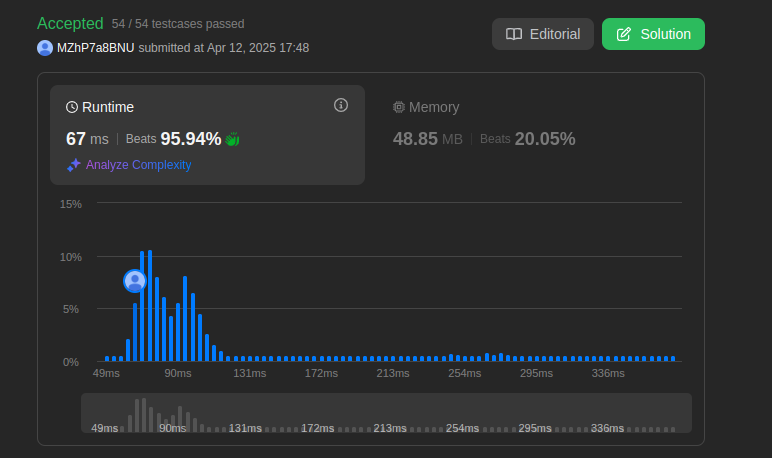

Reason You are a algorithmic problem solver. you should give your answer in pythonic code. be precise and careful about your solution.

# 2140. Solving Questions With Brainpower

You are given a 0-indexed 2D integer array questions where questions[i] = [pointsi, brainpoweri].

The array describes the questions of an exam, where you have to process the questions in order (i.e., starting from question 0) and make a decision whether to solve or skip each question. Solving question i will earn you pointsi points but you will be unable to solve each of the next brainpoweri questions. If you skip question i, you get to make the decision on the next question.

For example, given questions = [[3, 2], [4, 3], [4, 4], [2, 5]]:
If question 0 is solved, you will earn 3 points but you will be unable to solve questions 1 and 2.
If instead, question 0 is skipped and question 1 is solved, you will earn 4 points but you will be unable to solve questions 2 and 3.
Return the maximum points you can earn for the exam.

Example 1:

Input: questions = [[3,2],[4,3],[4,4],[2,5]]
Output: 5
Explanation: The maximum points can be earned by solving questions 0 and 3.
- Solve question 0: Earn 3 points, will be unable to solve the next 2 questions
- Unable to solve questions 1 and 2
- Solve question 3: Earn 2 points
Total points earned: 3 + 2 = 5. There is no other way to earn 5 or more points.
Example 2:

Input: questions = [[1,1],[2,2],[3,3],[4,4],[5,5]]
Output: 7
Explanation: The maximum points can be earned by solving questions 1 and 4.
- Skip question 0
- Solve question 1: Earn 2 points, will be unable to solve the next 2 questions
- Unable to solve questions 2 and 3
- Solve question 4: Earn 5 points
Total points earned: 2 + 5 = 7. There is no other way to earn 7 or more points.
 

Constraints:

1 <= questions.length <= 10^5
questions[i].length == 2
1 <= pointsi, brainpoweri <= 10^5


write your answer in this way:

class Solution(object):
    def mostPoints(self, questions):
        """
        :type questions: List[List[int]]
        :rtype: int
        """


---

## answer

```python
class Solution(object):
    def mostPoints(self, questions):
        """
        :type questions: List[List[int]]
        :rtype: int
        """
        n = len(questions)
        # dp[i] represents the maximum points that can be earned from i to end
        dp = [0] * (n + 1)
        
        # Iterate in reverse order, so later decisions are already computed.
        for i in range(n - 1, -1, -1):
            points, brainpower = questions[i]
            next_index = i + brainpower + 1
            # If next_index is out of bounds, we add 0 points.
            if next_index < n:
                take = points + dp[next_index]
            else:
                take = points
            skip = dp[i + 1]
            dp[i] = max(take, skip)
        
        return dp[0]
```

---

## result

