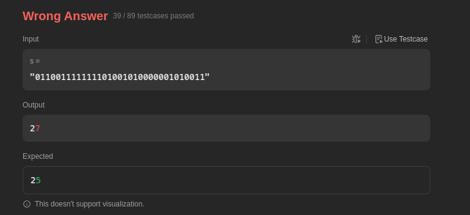

You are a algorithmic problem solver. you should give your answer in pythonic code. be precise and careful about your solution.

# 2167. Minimum Time to Remove All Cars Containing Illegal Goods

You are given a 0-indexed binary string s which represents a sequence of train cars. s[i] = '0' denotes that the i th car does not contain illegal goods and s[i] = '1' denotes that the ith car does contain illegal goods.As the train conductor, you would like to get rid of all the cars containing illegal goods. You can do any of the following three operations any number of times:

Remove a train car from the left end (i.e., remove s[0]) which takes 1 unit of time.
Remove a train car from the right end (i.e., remove s[s.length - 1]) which takes 1 unit of time.
Remove a train car from anywhere in the sequence which takes 2 units of time.
Return the minimum time to remove all the cars containing illegal goods.

Note that an empty sequence of cars is considered to have no cars containing illegal goods.

 
Example 1:

Input: s = "1100101"
Output: 5
Explanation: 
One way to remove all the cars containing illegal goods from the sequence is to
- remove a car from the left end 2 times. Time taken is 2 * 1 = 2.
- remove a car from the right end. Time taken is 1.
- remove the car containing illegal goods found in the middle. Time taken is 2.
This obtains a total time of 2 + 1 + 2 = 5. 

An alternative way is to
- remove a car from the left end 2 times. Time taken is 2 * 1 = 2.
- remove a car from the right end 3 times. Time taken is 3 * 1 = 3.
This also obtains a total time of 2 + 3 = 5.

5 is the minimum time taken to remove all the cars containing illegal goods. 
There are no other ways to remove them with less time.
Example 2:

Input: s = "0010"
Output: 2
Explanation:
One way to remove all the cars containing illegal goods from the sequence is to
- remove a car from the left end 3 times. Time taken is 3 * 1 = 3.
This obtains a total time of 3.

Another way to remove all the cars containing illegal goods from the sequence is to
- remove the car containing illegal goods found in the middle. Time taken is 2.
This obtains a total time of 2.

Another way to remove all the cars containing illegal goods from the sequence is to 
- remove a car from the right end 2 times. Time taken is 2 * 1 = 2. 
This obtains a total time of 2.

2 is the minimum time taken to remove all the cars containing illegal goods. 
There are no other ways to remove them with less time.
 

Constraints:

1 <= s.length <= 2 * 10^5
s[i] is either '0' or '1'.


write your answer in this way:

class Solution(object):
    def minimumTime(self, s):
        """
        :type s: str
        :rtype: int
        """
        
---

## answer

```python
class Solution(object):
    def minimumTime(self, s):
        """
        :type s: str
        :rtype: int
        """
        n = len(s)
        # Gather indices of cars with illegal goods.
        illegal = [i for i, ch in enumerate(s) if ch == '1']
        if not illegal:
            return 0
        
        # The idea is to choose a partition of the illegal cars into two parts:
        # - The first part (if any) is removed by removing cars from the left end.
        #   To remove the illegal car at index illegal[k-1] by left removals,
        #   we must remove the first illegal[k-1] + 1 cars (cost = illegal[k-1] + 1).
        # - The second part (if any) is removed by removing cars from the right end.
        #   To remove the illegal car at index illegal[k] by right removals,
        #   we must remove the last n - illegal[k] cars (cost = n - illegal[k]).
        #
        # By trying every possible partition (k from 0 to len(illegal)), we cover all
        # strategies where we remove some illegal cars from the left, some from the right.
        # The total cost is the sum of the left removals and right removals.
        
        ans = float('inf')
        m = len(illegal)
        for k in range(m + 1):
            left_cost = illegal[k - 1] + 1 if k > 0 else 0
            right_cost = n - illegal[k] if k < m else 0
            ans = min(ans, left_cost + right_cost)
        
        return ans
```

---

## result

